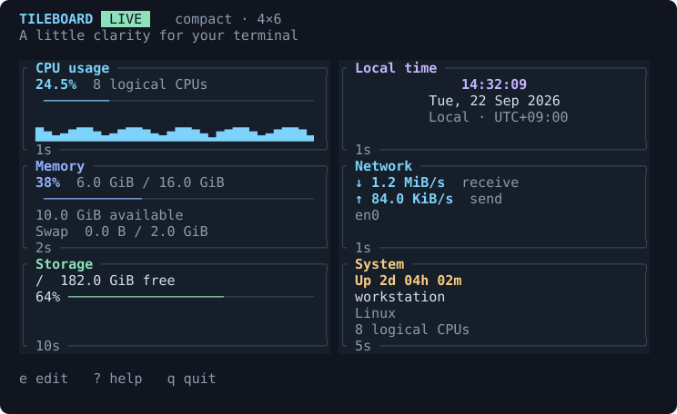

# Tileboard

A Rust terminal dashboard with a snapping grid, spanning tiles, and layouts you control.

Six built-in tiles cover CPU, memory and swap, network throughput, storage, local time, and system uptime. Tiles are ordinary Rust modules compiled into the application. Layouts, titles, colors, and tile settings live in TOML and can change without rebuilding.



[Wide layout](docs/previews/wide.svg) · [Small layout](docs/previews/small.svg) · [Settings](docs/previews/settings.svg)

Soft accent colors, muted borders, padded cards, and slim usage bars keep the dashboard readable. Previews use sample data; live tiles display your machine's metrics.

## Run

Install [Rust](https://rustup.rs/) (1.95 or newer; current stable recommended), then:

```sh
cargo run --release --locked
```

Or install the binary:

```sh
cargo install --path . --locked
tileboard
```

Linux, macOS, and Windows are CI targets. Use a UTF-8 terminal; SSH works when the terminal forwards input and resize events. Mouse support depends on the terminal. Every editing operation is available from the keyboard.

Existing configuration files and layouts are preserved. Add new tiles with **e → a** (free some cells first), or try the six-tile layout with `cargo run --release -- --config examples/dashboard.toml`.

The first launch creates a default configuration in the platform's user configuration directory. To keep a configuration in a known location:

```sh
tileboard --config ./dashboard.toml
tileboard --config ./dashboard.toml --check
tileboard --print-default-config
```

`--check` validates an existing file without starting the UI or creating a file. Invalid configurations produce an error and remain untouched.

## Edit your dashboard

Press **e** to start an edit session. The shown profile stays pinned while editing, including when the terminal changes size. Changes affect that profile only. Press **p** to work on another profile. A dot next to EDIT indicates unsaved changes; undo returns to the profile and tile affected by the edit.

| Control | Action |
| --- | --- |
| Tab / Shift+Tab | Select next / previous tile |
| Arrow keys | Preview a move by one grid cell |
| Shift+arrow keys | Preview resizing by one grid cell |
| h / l | Shrink / grow width (alternative to Shift+arrows) |
| k / j | Shrink / grow height |
| Enter | Apply a valid preview |
| Mouse drag | Move a tile; release applies a valid move |
| Drag bottom-right ◢ | Resize a tile |
| a | Add a tile to a readable empty area |
| d / Delete | Remove the selected tile |
| t | Edit title, accent, and tile-specific options |
| u | Undo an applied edit (up to 100 changes) |
| p | Cycle responsive profiles |
| s | Save all profiles and leave edit mode |
| Esc | Discard a preview; otherwise cancel the entire edit session |
| ? | Show help |

Occupied cells block moves and resizes. The candidate turns red; the original placement stays unchanged. Correct the candidate or press Esc to discard it. Pending previews must be applied or discarded before saving. To add a tile to the initially full layout, shrink or remove an existing tile first.

In settings, **Tab** changes fields, **Ctrl+u** clears the current field, and **Enter** applies. Left/Right and Home/End move the text cursor; Backspace/Delete edit text, and bracketed paste is supported. In the accent field, Left/Right cycles colors. Long fields scroll to keep the cursor visible. Colors: `cyan`, `magenta`, `green`, `yellow`, `blue`, `red`, `white`. The clock accepts a Chrono/strftime format such as `%H:%M:%S` or `%I:%M %p`. Storage accepts an exact mount path; leave it empty to show all mounts. Network accepts an exact interface name; leave it empty to display the busiest interface (excluding `lo`/`lo0`). Unavailable interfaces stay unavailable instead of silently substituting another one.

Outside edit mode, **r** reloads TOML and **q** exits. **Ctrl+c** exits immediately and discards unsaved edits. Saving writes a temporary file in the config directory before replacing the old file. It serializes the configuration, so hand-written comments and formatting are not preserved. Avoid editing the TOML externally during an active UI edit session.

## Responsive rules

See [examples/dashboard.toml](examples/dashboard.toml) for a complete working configuration. Profiles are checked **in file order; the first match wins**. The last profile must be an unconditional fallback. The defaults use these rules:

| Profile | Matches | Visible tiles |
| --- | --- | --- |
| wide | ≥110 columns, ≥18 rows | All six, three across |
| compact | ≥70 columns, ≥22 rows | All six, two across |
| tall | ≥36 rows | All six stacked |
| small | ≥18 rows | CPU, clock, memory stacked |
| short | ≥70 columns | CPU, memory, clock side by side |
| minimal | Otherwise | CPU, using the available space |

All rules, placements, and visible tiles remain user-defined. The small profiles deliberately show fewer tiles rather than squeeze six unreadable cards onto the screen. Width and height refer to the whole terminal in character cells, including the dashboard header and footer.

```toml
version = 1

[[profiles]]
name = "wide"
min_width = 110
min_height = 24
# Optional inclusive limits:
# max_width = 250
# max_height = 80
# min_aspect = 2.0
# max_aspect = 5.0
columns = 6
rows = 4

[[profiles.tiles]]
id = "cpu-main"
kind = "cpu"
title = "CPU usage"
accent = "cyan"
[profiles.tiles.placement]
column = 0
row = 0
column_span = 4
row_span = 2

[[profiles]]
name = "fallback"
columns = 2
rows = 4
# Add this profile's tiles here.
```

Positions start at zero. A tile may span any number of cells within its grid. Each profile defines its own tiles and settings; omit a tile from a profile to hide it at that size. Grid dimensions range from 1 to 64. Terminal cells are distributed proportionally, including leftover columns/rows. Aspect means terminal columns divided by rows, not a physical pixel ratio.

Grid dimensions and responsive rules are edited in TOML; tile placement and settings are also editable in the UI. Tiles below their minimum readable size show a compact placeholder. Terminals smaller than 26×10 show a resize prompt. There is no automatic rearranging, scrolling, or hidden collision resolution.

## Write a Rust tile

1. Add a module under `src/tiles/` implementing `Tile`.
2. Supply a `TileDefinition` with a unique kind, factory, configuration fields, and validator.
3. Register it in `Registry::builtin()` in `src/tiles/mod.rs`.
4. Rebuild with Cargo. The tile appears in the **Add tile** menu.

The existing [clock tile](src/tiles/clock.rs) is a small example. The [CPU tile](src/tiles/cpu.rs) shows persistent state and sample updates.

```rust,ignore
impl Tile for MyTile {
    fn update(&mut self, config: &TileConfig, metrics: &Metrics) {
        // Update state when the shared system sample changes.
    }

    fn render(
        &self,
        frame: &mut ratatui::Frame,
        area: ratatui::layout::Rect,
        config: &TileConfig,
        metrics: &Metrics,
    ) {
        frame.render_widget(ratatui::widgets::Paragraph::new("Hello"), area);
    }
}
```

The host draws the title/border and supplies the tile's inner rectangle. Draw only within that rectangle. `minimum_size()` includes the surrounding border. Configurable tile options are strings, exposed through the settings form. Keep `update` and `render` quick; custom network or disk work belongs on a worker thread. Tiles are trusted application code and are not isolated from crashes. The optional `handle_key` hook is reserved for future interaction; the current dashboard does not dispatch input to tiles.

## Development

```sh
cargo fmt --all -- --check
cargo clippy --locked --all-targets -- -D warnings
cargo test --locked --all-targets
```

System data comes from `sysinfo` on a worker thread. CPU, memory, network, and uptime are sampled roughly each second after an initial warm-up; disks refresh about every 10 seconds. Network throughput uses byte counter deltas divided by actual elapsed time, and resets its baseline when an interface appears or its counters reset. Auto selection reports one interface, avoiding the double-counting caused by adding physical, virtual, and VPN adapters. Memory usage is total minus available memory; cached/reclaimable memory is treated as available by the OS. Time follows the local clock. Storage lists mounted filesystems individually instead of summing them, since mounts can share backing devices. Missing mounts and delayed metrics are displayed explicitly.

Source structure:

- `config.rs`: TOML schema, profile rules, validation, atomic saves.
- `grid.rs`: spanning placement, collision checks, terminal/grid coordinate mapping.
- `app.rs`: editor transactions, previews, undo, keyboard/mouse handling.
- `ui.rs`: dashboard and editor rendering.
- `metrics.rs`: background system sampling.
- `tiles/`: registry, tile API, and built-in implementations.
- `theme.rs`: shared colors and byte formatting.

For UI verification and review notes, see [docs/ux-review.md](docs/ux-review.md). Reproduce the real-terminal checks on Linux/macOS with Python 3.11+ and tmux:

```sh
cargo build --locked
python3 scripts/ui_smoke.py
cargo run --locked --example preview -- docs/previews
```

The smoke test uses isolated temporary configs. The preview example renders the actual UI with fixed sample data into SVG files; it never reads live system metrics.
